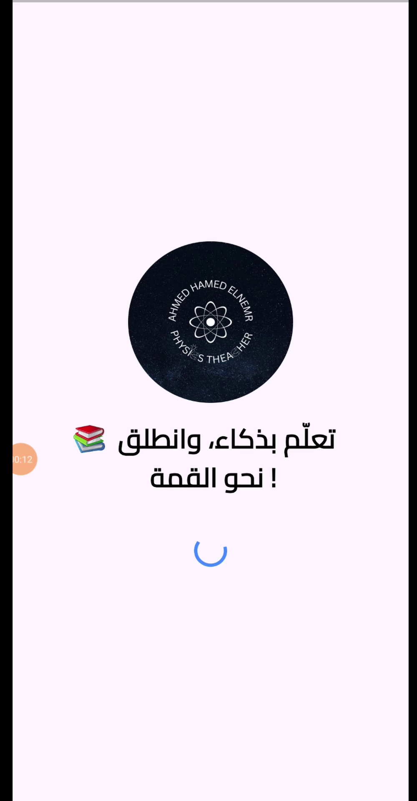
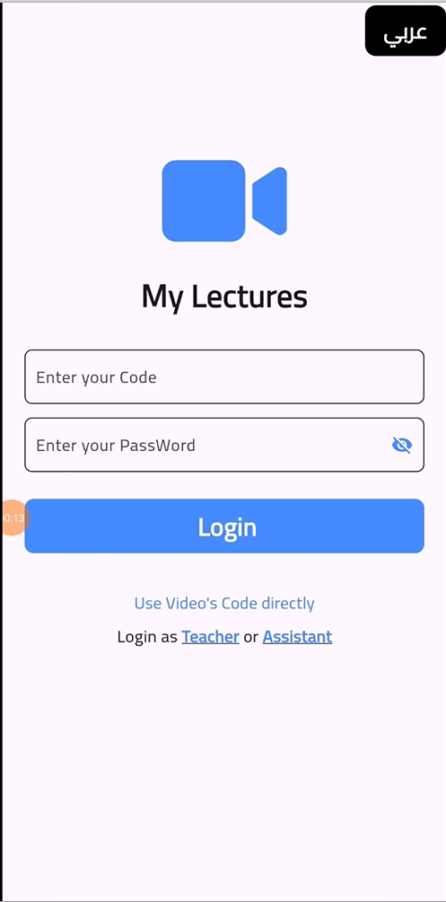
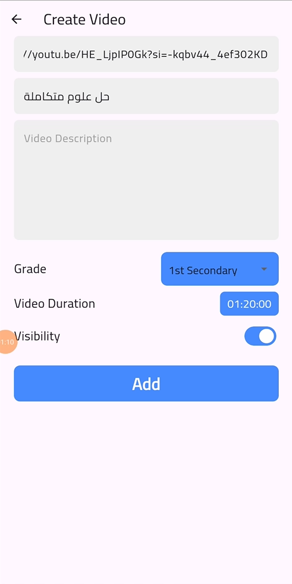
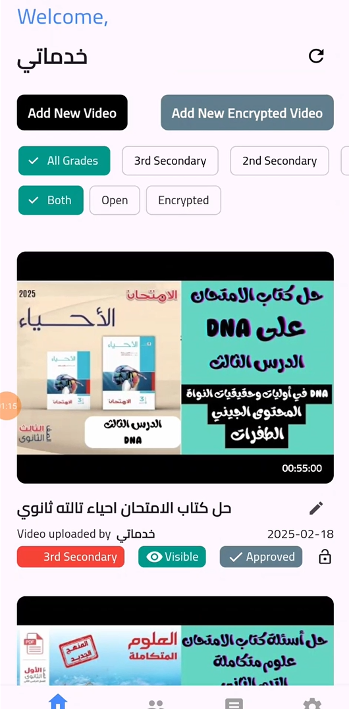
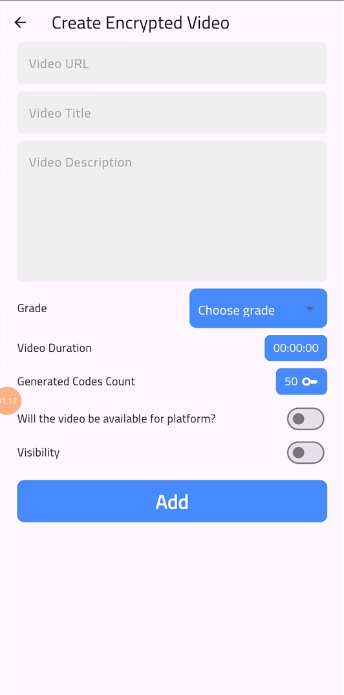
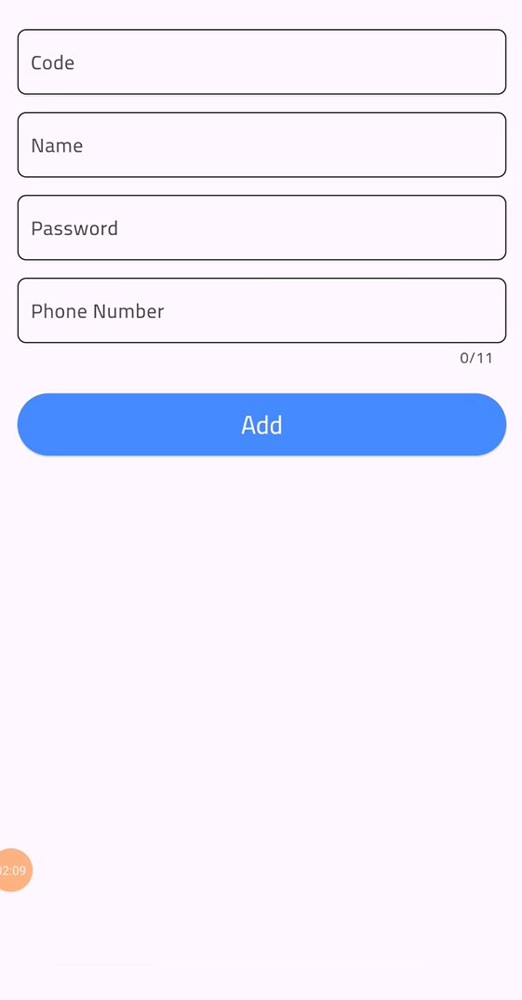
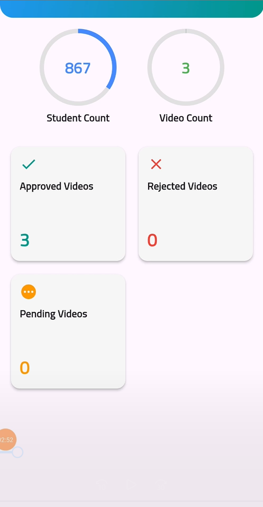
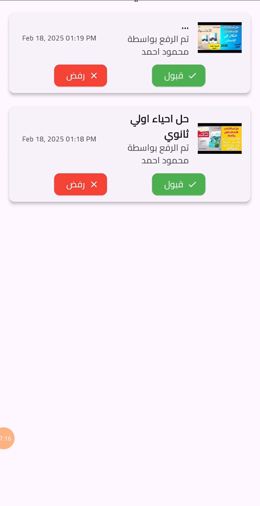
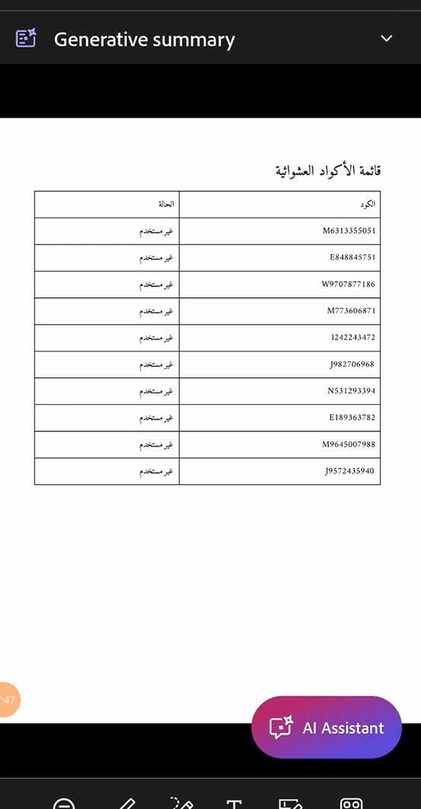

# 📚 LMS App – Flutter + Firebase

A full-featured Learning Management System (LMS) application built using **Flutter** and **Firebase**, without the need for a custom backend.  
Designed to offer a secure, structured, and efficient learning environment for **teachers, assistants, and students**.

---

## 🌟 Key Features

### ✅ Three User Roles
- 👩‍🏫 **Teacher:** Full control over students, videos, and content approval.
- 🧑‍💼 **Assistant:** Upload videos (requires approval), manage students.
- 👨‍🎓 **Student:** View allowed videos based on grade and payment status.

### 📹 Video Management System
- **Normal Videos:** Public to paid students, editable and can be hidden.
- **Encrypted Videos:** Require unique one-time codes to access.
- **Code Expiry:** Codes expire after 1.5× video duration to prevent sharing.

### 🔐 Secure Video Playback
- No screen recording allowed (via `no_screenshot` package).
- Teachers can export code access logs as **PDF reports**.

### 👥 Student Management
- Add, update, or remove student accounts.
- Filter by name, grade, or code.
- Video access tied to **payment verification**.

### 📊 Comprehensive Reports
- Number of videos/students.
- Pending assistant videos.
- Quick links to student detail pages.

---

## 🧱 Built Without Backend
- **Firebase Auth & Firestore** for all authentication and storage.
- No external backend or server required.

---

## 🧰 Tech Stack & Packages

### 🔹 Firebase
- `firebase_auth`, `firebase_core`, `cloud_firestore`

### 🔹 State Management
- `bloc`, `flutter_bloc`, `equatable`

### 🔹 UI & Performance
- `google_fonts`, `cached_network_image`, `percent_indicator`

### 🔹 Localization & Routing
- `easy_localization`, `go_router`

### 🔹 Security & Storage
- `no_screenshot`, `path_provider`, `open_file`, `device_info_plus`

### 🔹 Media & PDF
- `youtube_player_flutter`, `pdf`, `json_serializable`

---

## 📸 Preview

| Splash | Login | Video Upload | Videos | Encrypted Video Upload | Add Assistant | Assistants | Dashboard | Pending Videos | Reports |
|-------|-----------|---------------|--------------|---------|--------|-----------|---------------|--------------|---------|
|  |  |  |  |  |  |  |  |  |  |

